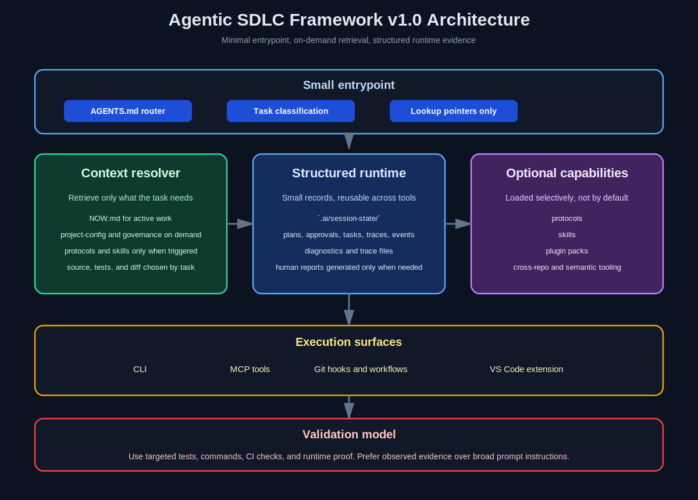

# Agentic SDLC Framework v1.0

[](https://github.com/Jarvis2021/agentic-sdlc-development/actions/workflows/ci.yml)
[]()

AI-assisted delivery framework focused on minimal prompt context, structured runtime evidence, and portable tooling across CLI, MCP, and editor integrations.

## Core principles

- Keep the default prompt surface small.
- Retrieve only the context needed for the current task.
- Prefer structured runtime records over large narrative summaries.
- Use tools and evidence for decisions whenever possible.
- Keep editor integrations thin and reuse the same core runtime.

## Quick start

```bash
# Scaffold a new project
npx agentic-sdlc-development my-project

# Or scaffold into an existing repository
cd your-project
npx agentic-sdlc-development init .
```

The scaffolder copies the small entrypoint and supporting runtime files, initializes `.ai/session-state/`, and prepares optional workflow helpers for your repository.

## What this repository provides

- `AGENTS.md` as a small routing entrypoint
- `.ai/context-index.yaml` as a lookup map for on-demand retrieval
- `.ai/session-state/` for structured runtime state such as sessions, plans, traces, approvals, and events
- debug evidence capture for command, test, CI, and browser failures
- optional workflow protocols and skills under `.ai/protocols/` and `.ai/skills/`
- CLI commands for planning, trace capture, resume, events, and plugin inspection
- a VS Code extension package under `packages/vscode-extension/`

## Architecture



### Retrieval-first model

The framework is designed around small entrypoints and selective retrieval:

1. Start with `AGENTS.md`.
2. Classify the task.
3. Pull the smallest useful set of files, runtime state, tests, and rules.
4. Capture evidence back into structured artifacts.

### Runtime layers

| Layer | Purpose |
|-------|---------|
| Minimal entrypoint | Small router for classification and lookup pointers |
| Structured runtime | `.ai/session-state/`, traces, diagnostics, approvals, events |
| Optional workflows | Protocols and skills loaded only when the task requires them |
| Delivery helpers | CLI commands, MCP tools, hooks, and workflow templates |
| Editor shell | Thin integrations such as the VS Code package |

### Evidence flow

```text
Task request
-> classify and retrieve minimal context
-> run targeted tools and tests
-> capture structured evidence
-> inspect runtime state or generate human-facing reports when needed
```

## Why this approach

The project now explicitly favors context orchestration over large context dumps.

What to avoid:

- oversized `AGENTS.md` files
- broad repository summaries loaded by default
- prompt-heavy workflows that duplicate what tools can discover

What to prefer:

- small entrypoint files
- structured JSON or YAML state
- targeted retrieval of rules, tests, and contracts
- tool-based inspection for code, runtime, and delivery status

## Runtime commands

```bash
agentic-sdlc plan checkout-flow --title "Checkout flow hardening" --story PROJ-123
agentic-sdlc resume
agentic-sdlc trace --kind debug --command "npm test" --test-output "FAIL tests/cart.test.js"
agentic-sdlc events --limit 20
agentic-sdlc plugins list
```

## Delivery and validation

The repository includes delivery helpers and CI templates, but teams should treat them as repository automation that must be verified in their own environment.

- `scripts/ship.sh` is the preferred local delivery helper
- `.github/workflows/` contains reference workflows that may need hardening per repository
- runtime evidence should be used to support completion claims

Do not treat any helper as authoritative unless the repository configuration actually enforces the required checks.

## Review and debugging

Recommended review pattern:

- inspect the diff and impacted files
- gather targeted tests and runtime proof
- capture findings with explicit evidence references
- use structured diagnostics and traces for debugging work

Recommended debugging pattern:

- capture the failing command, output, or browser verification
- inspect `.ai/session-state/diagnostics/` and `.ai/traces/`
- rerun only the most relevant checks

## VS Code extension

The VS Code package is a debug-first shell over the same runtime:

```bash
cd packages/vscode-extension
npm install
npx @vscode/vsce package
```

The extension adds:

- Runtime and Diagnostics views
- commands for evidence capture
- resume snapshot inspection
- direct access to the latest trace file

## Multi-repo and governance

Multi-repo analysis, governance rules, and dependency overlays remain available, but they should be retrieved only when the task requires them. They are not meant to be loaded into every agent interaction by default.

## Contributing

See `CONTRIBUTING.md` for contribution guidelines.

When proposing changes, prefer:

- small routing updates
- structured runtime improvements
- targeted tools and adapters
- optional workflow capabilities instead of bigger default prompt surfaces

## Open source use

This project is MIT-licensed and designed for open-source adoption. You can copy, adapt, and extend it in personal, startup, internal, or commercial repositories.

## License

[MIT](LICENSE)

## Contact

- GitHub: [github.com/Jarvis2021/agentic-sdlc-development](https://github.com/Jarvis2021/agentic-sdlc-development)
- Issues: [github.com/Jarvis2021/agentic-sdlc-development/issues](https://github.com/Jarvis2021/agentic-sdlc-development/issues)
