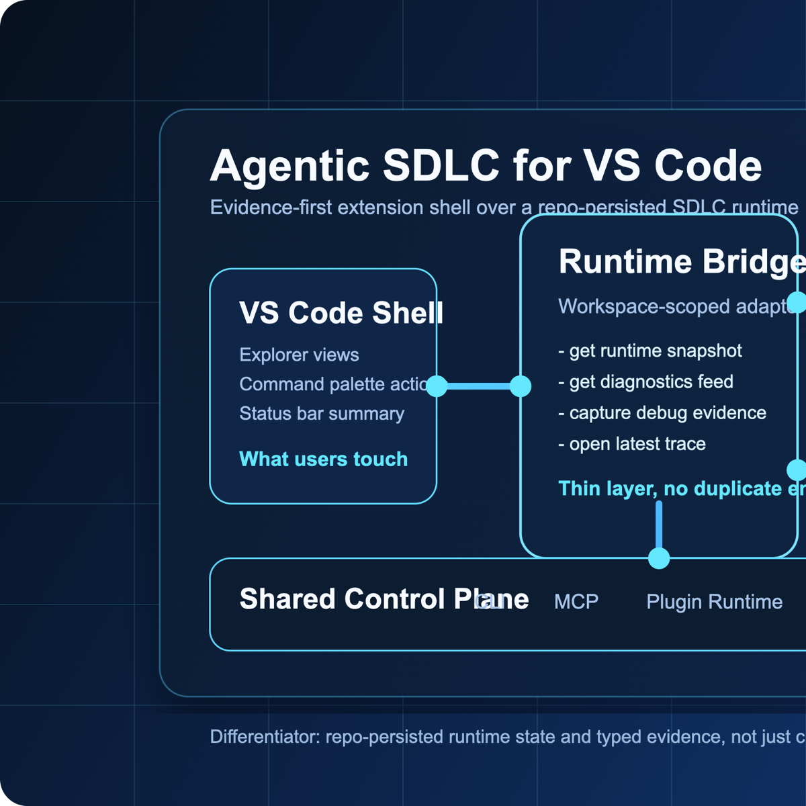

# Agentic SDLC

Evidence-first engineering workflows for Visual Studio Code.

`Agentic SDLC` brings the runtime-backed parts of the broader Agentic SDLC Framework into VS Code: structured diagnostics, resumable session state, trace capture, and a workspace view over the execution control plane already living in your repo.



## Why this extension exists

Most AI coding experiences are excellent at conversation, editing, and ad-hoc tool use. They are weaker at preserving execution evidence, resume context, and release-grade workflow state across sessions and across tools.

This extension focuses on the part that usually goes missing:

- Typed debug evidence for command, test, CI, and browser failures
- Workspace-scoped runtime state that survives editor restarts
- Trace markdown and event history stored in your repo, not trapped in chat history
- A thin VS Code shell over the same control-plane modules used by the CLI and MCP layers

## What you get

- **Runtime view** for active session, plan, trace, approvals, task counts, and recent events
- **Diagnostics view** for failure summaries by kind and severity
- **Capture commands** for command failures, test failures, CI failures, and browser verification
- **Resume snapshot** command that opens the structured runtime state as JSON
- **Latest trace** command that jumps directly to the most recent markdown trace in `.ai/traces/`

## Architecture

The VS Code extension does not create a second workflow engine. It reuses the same workspace-scoped runtime used by the framework itself.

### Control plane layers

1. **VS Code shell**
   Exposes views, commands, and status bar state inside the editor.
2. **Runtime bridge**
   Maps VS Code actions to the framework libraries.
3. **Workspace runtime**
   Reads and writes `.ai/session-state/`, `.ai/traces/`, and diagnostics artifacts.
4. **Core framework**
   Shares logic with the CLI, MCP surface, and repo-portable control plane.

## Where this fits

### Compared with IDE-native agent features

VS Code 1.110 already offers strong native agent capabilities such as agent plugins, browser tools, session memory, `/compact`, rename/usages tools, and the Agent Debug panel ([VS Code 1.110 release notes](https://code.visualstudio.com/updates/v1_110)).

This extension is meant to complement that layer, not duplicate it.

What Agentic SDLC adds on top:

- Repo-persisted runtime state under `.ai/session-state/`
- Typed evidence bundles that normalize command, test, CI, and browser failures
- Trace markdown and event history that remain available outside a single chat session
- A path toward release gates, review loops, and cross-repo impact workflows from the same control plane

### Compared with spec-first toolkits

Spec-first tools such as `spec-kit` are strong when the center of gravity is requirements, proposal quality, and implementation planning. Agentic SDLC is stronger when the center of gravity is **execution evidence**, **workflow state**, **review readiness**, and **resumable delivery control**.

### Compared with chat-first extensions

Chat-first tools optimize for request/response speed. Agentic SDLC optimizes for:

- continuity
- auditability
- delivery state
- operational debugging

## Feature map

| Capability | IDE-native agent features | Spec-first toolkits | Agentic SDLC |
| --- | --- | --- | --- |
| Chat, editing, and built-in tools | Strong | Partial | Uses VS Code surface |
| Persistent runtime state in repo | Limited | Partial | Strong |
| Typed failure evidence | Limited | Weak | Strong |
| Resume snapshots and trace files | Limited | Weak | Strong |
| Release-gate evolution path | Limited | Partial | Strong |
| Cross-tool portability (CLI + MCP + editor) | Limited | Partial | Strong |

## Quick start

1. Open a repository that already contains Agentic SDLC runtime files, or scaffold the framework first from the main repo:

```bash
npx agentic-sdlc-development init .
```

2. Install the extension from Marketplace or with:

```bash
code --install-extension PramodKumarVoola.agentic-sdlc-vscode
```

3. Open the Command Palette and run one of:

- `Agentic SDLC: Refresh`
- `Agentic SDLC: Capture Command Failure`
- `Agentic SDLC: Capture Test Failure`
- `Agentic SDLC: Capture CI Failure`
- `Agentic SDLC: Capture Browser Verification`
- `Agentic SDLC: Show Resume Snapshot`
- `Agentic SDLC: Open Latest Trace`

## Example workflow

1. A test run fails locally.
2. Run `Agentic SDLC: Capture Test Failure`.
3. The extension records structured diagnostics and a trace into your workspace.
4. Open the Runtime and Diagnostics views to inspect the updated state.
5. Use the trace and event files in review, CI triage, or follow-up automation.

## Settings

| Setting | Default | Purpose |
| --- | --- | --- |
| `agenticSdlc.eventsLimit` | `10` | Number of runtime events shown in the Runtime view |
| `agenticSdlc.autoRefresh` | `true` | Refresh views after capture commands complete |

## Requirements

- VS Code `1.110+`
- A workspace using the Agentic SDLC runtime layout
- `agentic-sdlc-development` available in the repo or installed as a package dependency

## Roadmap direction

This release is intentionally debug-first. The next layers are designed to grow from the same control plane:

- richer review and release gating
- approval queue operations
- cross-repo impact views
- plugin-pack visibility
- deeper MCP-assisted workflows

## Source

- GitHub: [Jarvis2021/agentic-sdlc-development](https://github.com/Jarvis2021/agentic-sdlc-development)
- Issues: [Report a problem](https://github.com/Jarvis2021/agentic-sdlc-development/issues)

MIT licensed.
